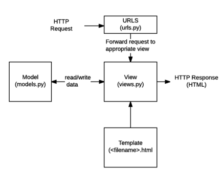
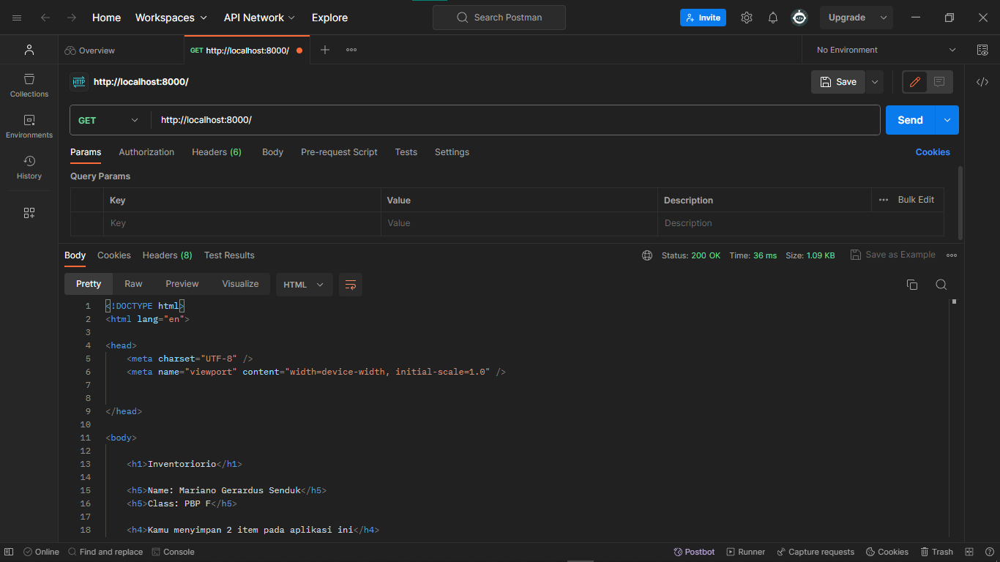
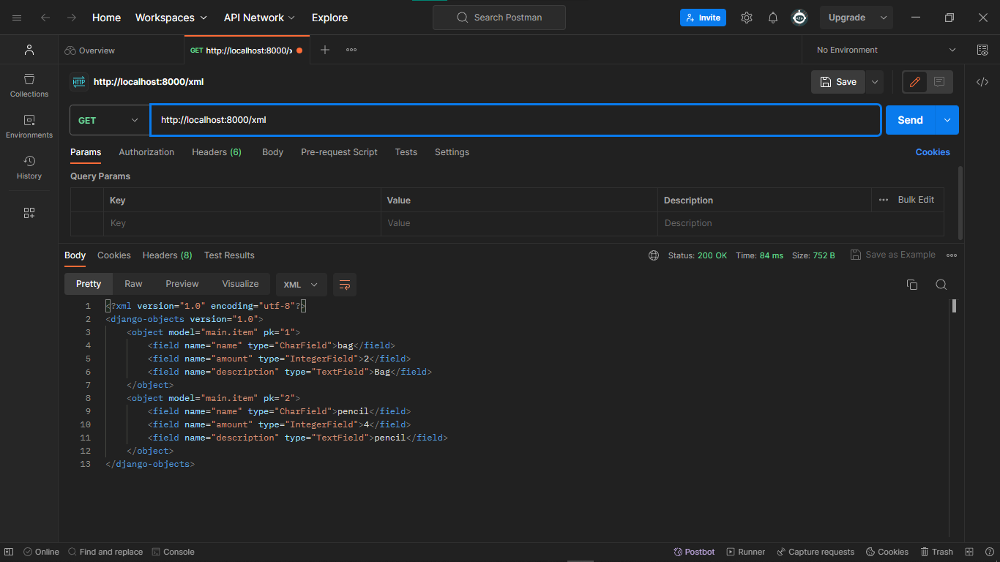
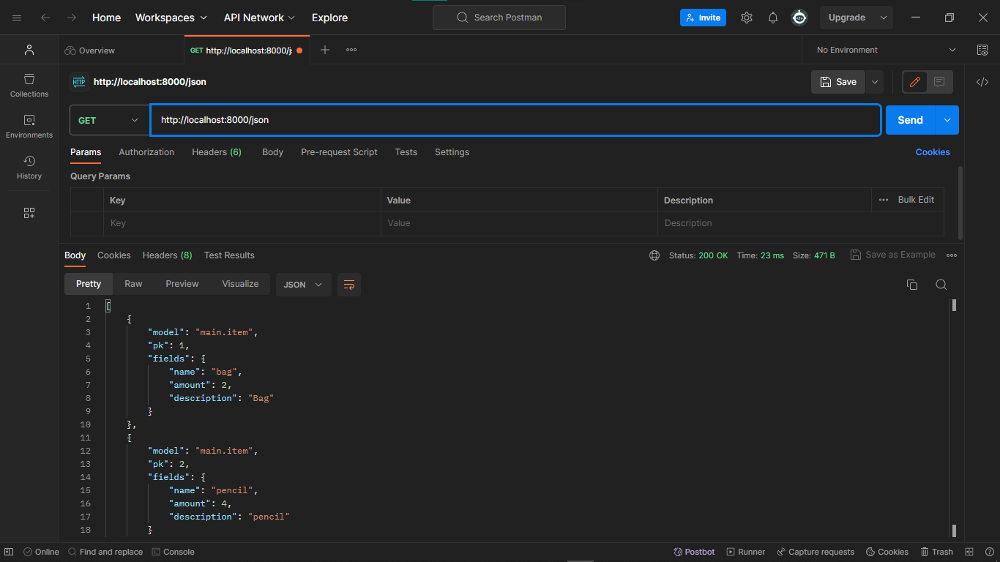
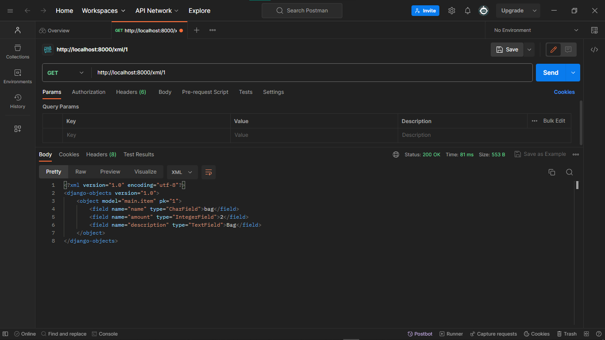
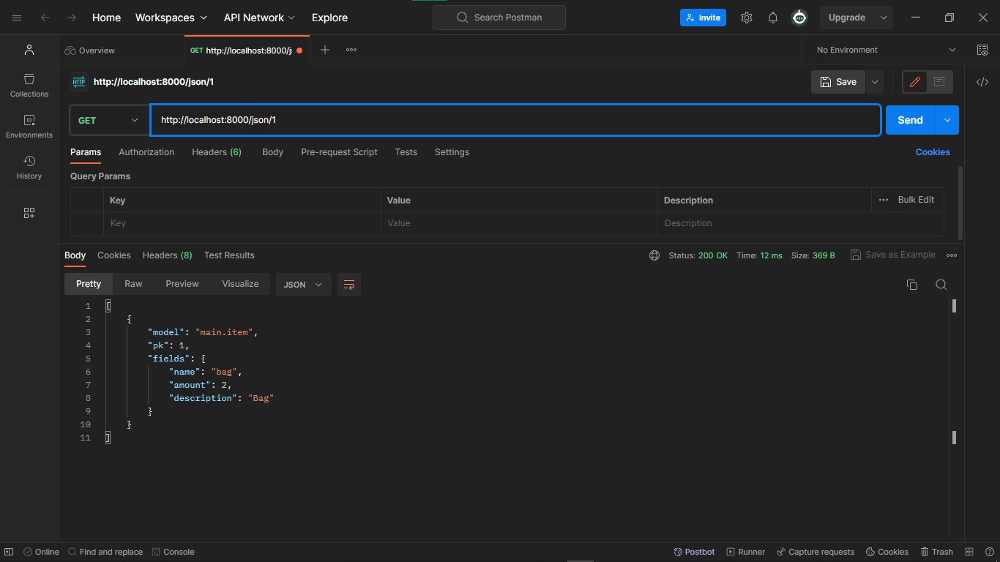

## [Link Aplikasi Inventoriorio](http://mariano-gerardus-tugas.pbp.cs.ui.ac.id/) - 

 

Tugas 2
 

## Step by step pengimplementasian

- Membuat direktori(utama) baru bernama ``inventoriorio``, lalu membuat virtual environment didalamnya dan kemudian diaktifkan
- Membuat berkas ``requirements.txt`` yang diisi dependencies dan kemudian diinstal
- Menetapkan nilai ``["*"]`` pada ``ALLOWED_HOST`` dalam berkas ``settings.py``
- Menambahkan berkas ``.gitignore``
- Membuat aplikasi baru bernama ``main`` dalam direktori
- Menambahkan ``main`` pada ``INSTALLED_APPS`` dalam berkas ``setting.py`` di direktori proyek
- Membuat model bernama ``Item`` dalam ``models.py`` dengan atribut ``name, description, dan amount``
- Melakukan migrasi model
- Mengisi berkas ``views.py``
- Membuat direktori ``templates`` dalam direktori ``main`` dan diisi berkas ``main.html``
- Membuat dan mengisi berkas ``urls.py`` dalam direktori ``main``
- Menambahkan rute url (yang mengarah ke ``main``) baru pada ``urlpatterns`` dalam berkas ``urls.py`` di direktori proyek
- Membuat unit test pada berkas ``tests.py``
- Membuat repo baru pada github dengan nama ``inventoriorio``
- Menghubungkan repo lokal dengan repo pada github
- Melakukan add, commit, dan push ke repo github
- Melakukan deployment aplikasi di ``Adaptable.io``

## Bagan request client dan kaitan diantaranya

Client ingin masuk ke url web kita, sehingga browser melakukan HTTP request. Request tersebut kemudian akan diterima dan diproses oleh `urls.py`. Setelah request di proses dalam `urls.py`, kemudian akan dipanggil function yang sesuai yang ada dalam `views.py`.Akan dilakukan operasi dalam `views.py` seperti transaksi data dari/ke `models.py`. Kemudian setelah itu `views.py` akan mengembalikan respon template HTML yang sesuai kembali kepada client.

## Mengapa venv dibutuhkan 

Virtual environment(venv) adalah lingkungan terisolasi. Virtual environment berguna agar setiap proyek yang berbeda memiliki lingkungan terisolasi sehinga masing - masing proyek dapat memiliki dependensinya masing - masing.
Kita dapat membuat aplikasi berbasis django tanpa menggunakan virtual environment, namun tentunya jika kita bekerja dalam beberapa proyek berbeda bisa saja terjadi konflik antar proyek tersebut yang disebabkan oleh dependensi yang berbeda.

## MVC, MVT, dan MVVM

- MVC (Model View Controller)
    - Model: Mengurusi bagian logika, data, dan berhubungan dengan database
    - View: Mengurusi UI, dengan menampilkan data dari model dan menerima pembaruan dari controller
    - Controller: Perantara model dan view, mengatur aliran aplikasi dan sinkronisasi antara model dan view
- MVT (Model View Template)
    - Model: Mengurusi bagian logika, data, dan berhubungan dengan database; tidak berhubungan langsung dengan view
    - View: Mengurusi UI, bergantung terhadap pembaruan dari controller 
    - Template: Menjembatani antara model dan view, menerima data dari model dan melakukan pembaruan ke view
- MVVM (Model View - ViewModel)
    - Model: Mengurusi bagian logika, data, dan berhubungan dengan database
    - View: Mengurusi UI, menampilkan data dari model
    - ViewModel: Menjembatani antara model dan view, menyediakan dan memanipulasi data untuk ditampilkan

 

Tugas 3

## Apa perbedaan antara form POST dan form GET dalam Django?

| POST | GET |
| :-: | :-: | 
| Nilai variabel tidak ditampilkan di URL | Nilai variabel ditampilkan di URL |
| Dapat memodifikasi input user sebelum masuk ke database | Tidak bisa memodifikasi input user |
| Lebih aman | Kurang aman |
| Tidak dibatasi panjang string | Dibatasi panjang string sampai 2047 karakter |
| Biasanya untuk input data melalui form | Biasanya untuk input data melalui link |
| Digunakan untuk mengirim data-data penting seperti password | Digunakan untuk mengirim data-data tidak penting |

## Apa perbedaan utama antara XML, JSON, dan HTML dalam konteks pengiriman data?

HTML(Hypertext Markup Language) cenderung digunakan untuk mengatur tampilan dan struktur dari halaman web, sehingga HTML tidak terlalu cocok digunakan untuk mengirim data mentah. XML(eXtensible Markup Language) menggunakan struktur tag dalam setiap data, ini menyebabkan XML lebih kompleks dan sulit untuk dibuat dan dibaca oleh manusia. JSON(JavaScript Object Notation) menyimpan data dengan object(pasangan key - value), sehingga JSON lebih simpel, ringan, dan lebih mudah untuk dibuat dan dibaca.

## Mengapa JSON sering digunakan dalam pertukaran data antara aplikasi web modern?

- Sederhana dan mudah dibaca.
- Lebih ringan dibandingkan format lain, sehingga pertukaran data menjadi tidak terbebani dan lancar.
- Mendungkung banyak bahasan pemrograman.
- Struktur data yang fleksibel, mudah untuk dimodifikasi.
- Keamanan yang lebih baik dibandingkan format lain.
- Popularitasnya yang tinggi membuat banyak web modern menggunakannya, sehingga lebih mudah integrasi antar aplikasinya.

## Step by step pengimplementasian

- Menambahkan folder `template` dalam direktori utama, dan diisi dengan `base.html` sebagai template dasar untuk halaman lainnya.
- Membuat dan mengisi berkas `forms.py` pada direktori `main`, berfungsi agar dapat menginput data(object model) untuk aplikasi.
- Menambahkan fungsi baru pada berkas `views.py` di direktori `main` dengan nama `create_item` untuk menyimpan data yang diinput/disubmit dalam forms.
- Membuat dan mengisi berkas baru `create_item.html` pada direktori `main/templates` sebagai halaman/template dari fungsi `create_item` untuk menginput data.
- Memodifikasi isi berkas `main.html` untuk menampilkan data item yang telah diinput, menampilkan jumlah item yang ada(telah diinput), dan menambahkan tombol `Add New Item` yang akan redirect ke halaman form.
- Menambahkan fungsi - fungsi baru pada berkas `views.py` di direktori `main`, yaitu fungsi `show_xml` dan `show_json` yang masing - masing berfungsi untuk menampilkan data dalam bentuk `XML` dan `JSON` secara kesuluruhan. Selain itu ditambahkan juga fungsi `show_xml_by_id` dan `show_json_by_id` untuk menampilkan data dalam bentuk `XML` dan `JSON` secara spesifik tergantung id yang diberikan.
- Melakukan routing URL dari fungsi - fungsi yang baru saja dibuat di atas dengan cara memodifikasi berkas `urls.py` di direktori `main`. Pada berkas `urls.py` diimport fungsi - fungsi tersebut, lalu ditambahkan semua path yang menuju fungsi - fungsi tersebut.

## Screenshot pengaksesan kelima URL menggunakan Postman

HTML:

XML:

JSON:

XML by id:

JSON by id:

 

Tugas 4

## Apa itu Django UserCreationForm, dan jelaskan apa kelebihan dan kekurangannya?

Django UserCreationForm adalah import bawaan dalam library Django yang bertujuan untuk memudahkan pembuatan formulir pendaftaran user/pengguna dalam aplikasi web. Dengan formulir ini, kelebihannya yaitu kita dapat membuat formulir pendaftaran user tanpa menulis kode dari awal lagi, karena sudah disediakan field - field input yang biasa diperlukan dalam registrasi aplikasi dan juga terdapat validasi terhadap input yang diberikan sehingga dapat membuat keamanan akun pengguna terjamin. Namun ada juga kekurangan dari UserCreationForm yaitu seperti kurangnya pilihan untuk kustomisasi dari segi visual, keterbatasan untuk kustomisasi fitur yang telah ada secara default seperti validasi input, dan lain - lain.

## Apa perbedaan antara autentikasi dan otorisasi dalam konteks Django, dan mengapa keduanya penting?

Autentikasi adalah proses verifikasi terhadap pengguna yang ingin masuk/mengakses aplikasi, sistem akan mengecek apakah pengguna yang ingin masuk ke dalam aplikasi adalah pengguna yang berhak/memiliki akses masuk. Contohnya saat melakukan proses login sistem akan memverifikasi pengguna misalnya berdasarkan input username dan password.
Otorisasi sendiri adalah proses untuk mengatur akses pengguna yang telah berhasil di-autentikasi sebelumnya terhadap aplikasi, seperti akses untuk memodifikasi model, melakukan operasi pada aplikasi, dan sebagainya. 
Kedua hal tersebut merupakan hal yang penting dalam aplikasi Django untuk menjaga keamanan aplikasi. Dengan adanya autentikasi  maka kita mengurangi resiko bagi sembarang orang khususnya yang berniat jahat untuk dapat masuk ke dalam aplikasi kita. Selain itu pengguna yang terautentikasi juga terbatasi aksesnya sesuai yang diizinkan/sesuai perannya dalam aplikasi sehingga tidak bisa sembarangan untuk memodifikasi data dari aplikasi.

## Apa itu cookies dalam konteks aplikasi web, dan bagaimana Django menggunakan cookies untuk mengelola data sesi pengguna?

Cookies adalah data dengan ukuran kecil yang disimpan pada komputer browser web yang digunakan saat mereka mengunjungi situs web. Cookies digunakan untuk menyimpan informasi yang dapat digunakan oleh server web untuk mengenali pengguna yang telah mengunjungi situs sebelumnya atau untuk menyimpan data sesi pengguna. Cookies menyimpan session ID dalam komputer pengguna, session ID ini yang kemudian dipetakan ke struktur data di sisi server web. Saat pengguna melakukan request maka browser web akan mengirimkan session ID ke server dan kemudian server akan mencari informasi berdasarkan session ID yang diterima lalu akan mengembalikan data yang diminta.

## Apakah penggunaan cookies aman secara default dalam pengembangan web, atau apakah ada risiko potensial yang harus diwaspadai?

Secara default penggunaan cookies aman untuk pengembangan web, ini karena cookies tidak akan menyebabkan pengaruh kepada device kita seperti terkena virus atau malware. Namun karena cookies sendiri menyimpan id unik dari pengguna, make dengan cookies tersebut seseorang dapat melacak jejak browsing dari pengguna dengan cookies(id) tersebut. Hal ini dapat disalahgunakan oleh orang - orang yang tidak bertanggung jawab. Oleh karena itu kita harus menghindari mengakses situs - situs yang mencurigakan, biasanya situs - situs ilegal dimana banyak *third party* cookies yang lebih rentan untuk dipersalahgunakan oleh seseorang. 

## Step by step pengimplementasian

- Membuat fungsi `register` dalam berkas `views.py` di direktori `main` yang berfungsi untuk membuat form registrasi untuk membuat akun pengguna baru. Setelah itu membuat berkas baru bernama `register.html` di direktori `main/templates` yang memuat halaman untuk form registrasi tersebut.
- Membuat fungsi `login_user` dalam berkas `views.py` di direktori `main` yang berfungsi untuk melakukan autentikasi pengguna yang ingin login. Setelah itu membuat berkas baru bernama `login.html` di direktori `main/templates` yang memuat halaman untuk login pengguna.
- Membuat fungsi `logout_user` dalam berkas `views.py` di direktori `main` yang berfungsi untuk mekanisme saat pengguna melakukan logout dari aplikasi.
- Melakukan routing URL dari semua fungsi yang baru saja dibuat di atas dengan cara memodifikasi berkas `urls.py` di direktori `main`. Pada berkas `urls.py` diimport fungsi - fungsi tersebut, lalu ditambahkan semua path yang menuju fungsi - fungsi tersebut.
- Memodifikasi isi berkas `main.html` di direktori `main/templates` dengan menambahkan button untuk logout.
- Melakukan restriksi terhadap fungsi `show_main` pada berkas `view.py` di direktori `main` agar halaman *main* hanya bisa diakses oleh pengguna yang telah ter-autentikasi.
- Mencoba membuat 2 akun pengguna baru pada aplikasi dengan menggunakan localhost dan kemudian menambahkan 3 dummy data pada setiap akun tersebut.
- Menambahkan fungsi untuk menambahkan *cookie* yang bernama `last_login` pada fungsi `login_user` dalam berkas `views.py` di direktori `main` untuk menampilkan `datetime` atau waktu terakhir kali pengguna login pada aplikasi. Dalam berkas yang sama, memodifikasi fungsi `show_main` dengan menambahkan kode `'last_login': request.COOKIES['last_login']` pada variabel `context`. Setelah itu memodifikasi fungsi `logout_user` untuk menghapus *cookie* `last_login` setelah pengguna logout. Terakhir, memodifikasi berkas `main.html` di direktori `main/templates` dengan menambahkan kode yang menunjukkan data `last_login`.
- Menghubungkan model `Item` dengan pengguna dengan cara memodifikasi berkas `models.py` di direktori `main` dengan menambahkan `ForeignKey` yang bertujuan untuk membuat *relationship* antara satu `Item` dengan satu pengguna. Kemudian memodifikasi fungsi `create_item` pada berkas `views.py` di direktori `main` untuk mencegah Django langsung menyimpan objek yang dibuat ke dalam database. Setelah itu memodifikasi isi variabel `context` pada fungsi `show_main` dalam berkas `views.py` di direktori `main` yaitu mengubah *value* 'name' menjadi sesuai dengan username pengguna yang login. Terakhir adalah melakukan migrasi model.
##### Bonus
- Membuat fungsi - fungsi baru dalam berkas `views.py` di direktori `main`, yaitu fungsi `plus` yang berfungsi untuk menambahkan `amount` sebanyak 1 dari item yg dipilih, fungsi `minus` yang berfungsi untuk mengurangi `amount` sebanyak 1 dari item yg dipilih(jika setelah dikurang 1 `amount` menjadi 0, maka item akan di hapus), dan fungsi `remove` yang berfungsi untuk menghapus item yang dipilih. 
- Melakukan routing URL semua fungsi tersebut pada berkas `urls.py` di direktori `main`.
- Memodifikasi berkas `main.html` di direktori `main/templates` dengan menambahkan button `plus 1` (untuk fungsi `plus`), button `minus 1` (untuk fungsi `minus`), dan button `remove` (untuk fungsi `remove`) di sebelah setiap item yang ada dalam table.

 

Tugas 5
 

## Jelaskan manfaat dari setiap element selector dan kapan waktu yang tepat untuk menggunakannya.

- Element selector : Untuk mengubah properti pada semua element dengan tag yang sama, berguna untuk mengubah properti pada element dengan tag yang ditentukan pada satu proyek.
- ID selector : Untuk mengubah properti pada element dengan dengan id yang unik, berguna untuk mengubah properti pada element secara spesifik tergantung id yang ditentukan.
- Class selector : Untuk mengelompokkan beberapa element dengan suatu karakteristik yang sama, berguna untuk mengubah properti element secara kesuluruhan dengan class yang ditentukan.

## Jelaskan HTML5 Tag yang kamu ketahui.

- `<nav>` : untuk menandai bagian navigasi dari halaman web
- `<header>` : menandai bagian kepala dari dari halaman web
- `<body>` : menandai badan dari halaman web
- `<dev>`: menandai suatu bagian dari halaman web
- `<footer>` : menandai bagian kaki/bawah dari halaman web
- `<time>` : menandari waktu 

## Jelaskan perbedaan antara margin dan padding.

- Margin : adalah ruang di luar batas elemen, biasanya transparan, membatasi ruang antar elemen
- Paddding : adalah ruang di dalam batas elemen, menandai ruang antara isi konten dengan batas ruang element, biasanya memiliki background warna atau gambar

## Jelaskan perbedaan antara framework CSS Tailwind dan Bootstrap. Kapan sebaiknya kita menggunakan Bootstrap daripada Tailwind, dan sebaliknya?

| Tailwind | Bootstrap |
| :-: | :-: | 
| Ukuran file yang lebih kecil | Ukuran file lebih besar karena termasuk komponen yang telah didefinisikan |
| Fleksibilitas dan adaptasi yang tinggi | Tampilan yang lebih konsisten pada seluruh proyek |
| Lebih sulit karena harus memahami banyak kelas yang ada | Lebih mudah karena sudah disediakan banyak komponen |

Kita menggunakan bootstrap jika memerlukan pengembangan yang cepat, konsistensi keseluruhan proyek, dan tidak memerlukan kustomisasi yang banyak.
Sebaliknya, kita menggunakan tailwind saat memerlukan kustomisasi yang banyak dan lebih fleksibel.

## Step by step pengimplementasian

- Menambahkan bootstrap pada proyek kita.
- Menambahkan navigation bar pada halaman `main`, yang berisi username dari pengguna yang login, lalu tombol logout.
- Memodifikasi halaman `login`, `register`, dan `create_item`, dengan memosisikan content ke tengah, lalu button - button yang ada diganti menjadi *layout button*. 
- Memodifikasi halaman `main`, mengubah `background color`, mengubah button - button yang ada menjadi *layout button*, lalu juga mengganti warna dari item terakhir yang ada pada aplikasi menjadi warna merah.

 

Tugas 6

## Jelaskan perbedaan antara asynchronous programming dengan synchronous programming.

Dalam *synchronous* programming operasi/tugas dijalankan satu per satu sesuai urutannya, berarti hanya satu operasi yang berjalan dalam satu waktu dan operasi berikutnya akan diproses setelah operasi saat ini selesai dijalankan. Sebaliknya dalam *asynchronous* programming operasi/tugas dapat berjalan secara independen satu sama lain, berarti beberapa operasi dapat berjalan dalam satu waktu secara bersama. 

## Dalam penerapan JavaScript dan AJAX, terdapat penerapan paradigma event-driven programming. Jelaskan maksud dari paradigma tersebut dan sebutkan salah satu contoh penerapannya pada tugas ini.

Paradigma event-driven programming melakukan eksekusi program yang dipicu oleh kejadian(events) yang terjadi, seperti input pengguna, pengambilan data, atau event lainnya. Dalam tugas ini contoh penerapannya ada pada button `Add Item by AJAX`, terdapat event listener *onclick* pada button tersebut yang akan memanggil fungsi `addItem()` saat button ditekan.

## Jelaskan penerapan asynchronous programming pada AJAX.

Penerapan *aysnchronous* programming pada AJAX seperti penggunaan **fetch API** yang mana membuat koneksi ke server secara asinkron dan mengirim serta menerima data tanpa memuat ulang halaman. Selain itu terdapat penggunaan fungsi **async** digunakan untuk menandai fungsi sebagai fungsi yang dapat mengembalikan nilai secara asinkronus dan juga fungsi **await** yang digunakan untuk menunggu hasil dari fungsi **async**.

## Pada PBP kali ini, penerapan AJAX dilakukan dengan menggunakan Fetch API daripada library jQuery. Bandingkanlah kedua teknologi tersebut dan tuliskan pendapat kamu teknologi manakah yang lebih baik untuk digunakan.

| Fetch API | jQuery |
| :-: | :-: | 
| Sintaks yang lebih bersih dan terbaca | Konfigurasi lebih banyak |
| Lebih ringan | Lebih besar karena memiliki banyak fitur selain AJAX |
| Tidak didukung di Internet Explorer | Mendukung sebagian besar browser, termasuk IE |
| Menggunakan Promises - lebih sederhana | Menggunakan callbacks - lebih kompleks |
| Fokus pada AJAX, tanpa menyertakan fitur-fitur lain | Menyertakan banyak fungsi utilitas dan fitur lainnya di luar AJAX |

Jika hanya membutuhkan AJAX dalam proyek kita maka lebih baik menggunakan Fetch API, namun jika membutuhkan utilitas yang lebih luas maka lebih baik menggunakan library jQuery. Fetch API lebih mudah dan simpel untuk digunakan juga, dan dalam PBP kita baru menerapkan AJAX sehingga lebih baik menggunakan Fetch API.

## Step by step pengimplementasian

- Membuat fungsi - fungsi baru pada berkas `views.py`, yaitu fungsi `get_item_json` dan fungsi `create_ajax`. 
- Memodifikasi berkas `main.html`, menghapus table untuk penampilan item yang lama. Kemudian membuat block *script* dan diisi fungsi - fungsi, yaitu fungsi `getItems` dan fungsi `refreshItems` yang menggantikan table yang lama agar dapat me-refresh data/item secara *asynchronous*. Penggunaan table untuk menampilkan item yang ada juga diganti menjadi *card*.
- Dalam berkas `main.html` dibuat modal untuk form dalam menambahkan item baru ke dalam aplikasi lalu ada juga button `Add Item by AJAX` untuk menampilkan modal tersebut. Kemudian menambahkan fungsi baru yaitu `addItems` dalam block *script* untuk menambahkan item yang baru diinput ke dalam aplikasi.
- Membuat fungsi - fungsi baru pada berkas `views.py`, yaitu fungsi `plus_ajax`, `minus_ajax`, dan `remove_ajax` untuk menggantikan fungsi yang sebelumnya menjadi menggunakan AJAX.
- Menambahkan fungsi - fungsi baru lagi ke dalam block *script* pada berkas `main.html`, yaitu fungsi `plusItem`, `minusItem`, dan `removeItem`. Fungsi tersebut dipanggil saat button '+', '-', dan 'remove' ditekan agar dapat melakukan "edit" terhadap item dalam *cards* secara *asynchronous*. 
- Melakukan routing pada berkas `urls.py` untuk semua fungsi - fungsi yang baru dibuat pada berkas `views.py`.
- Menambahkan path static dalam berkas `settings.py`. Lalu melakukan command `collectstatic`

