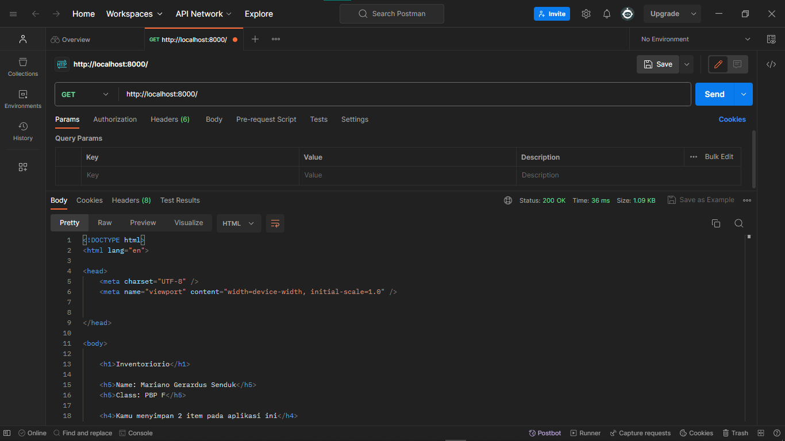
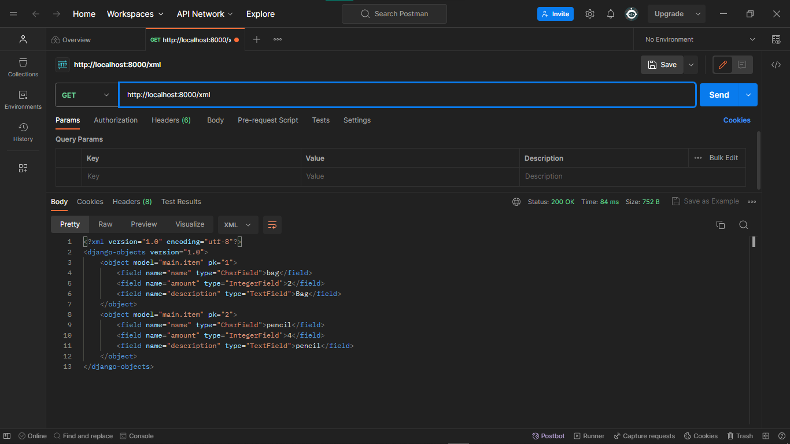
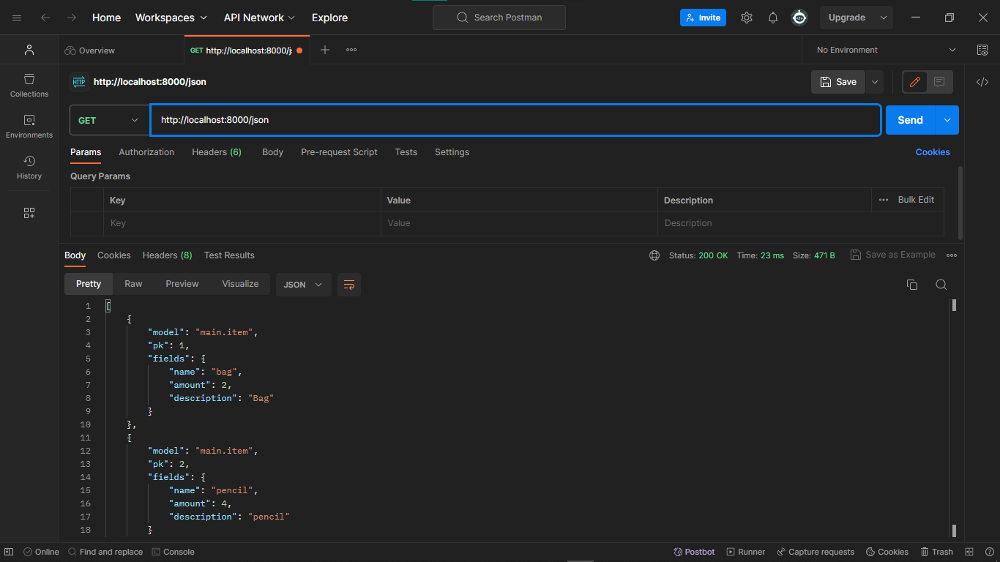
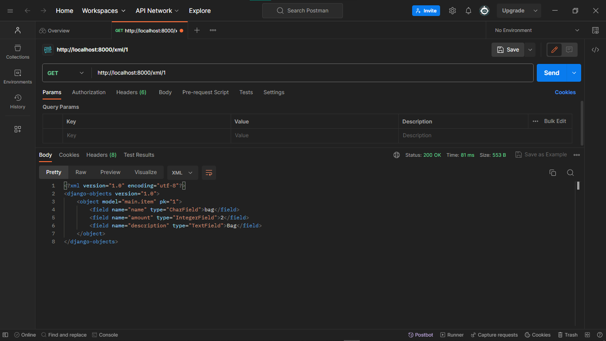
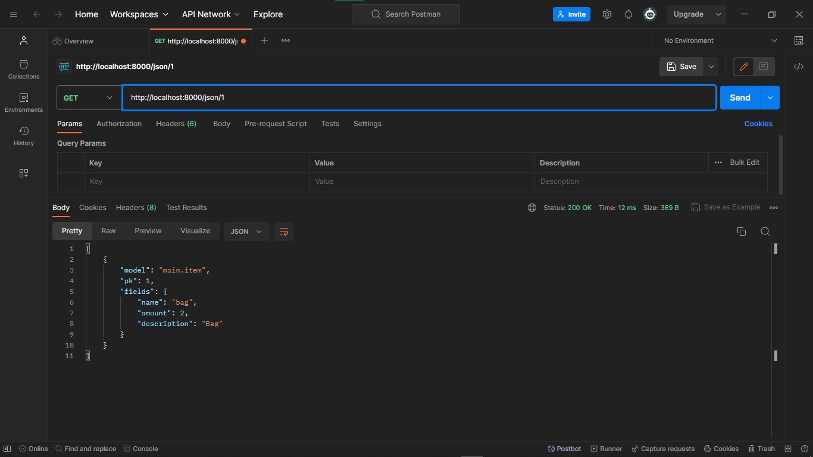

## [Link Aplikasi Inventoriorio](https://inventoriorio.adaptable.app/)

 

*Tugas 2*
 

## Step by step pengimplementasian

- Membuat direktori(utama) baru bernama ``inventoriorio``, lalu membuat virtual environment didalamnya dan kemudian diaktifkan
- Membuat berkas ``requirements.txt`` yang diisi dependencies dan kemudian diinstal
- Menetapkan nilai ``["*"]`` pada ``ALLOWED_HOST`` dalam berkas ``settings.py``
- Menambahkan berkas ``.gitignore``
- Membuat aplikasi baru bernama ``main`` dalam direktori
- Menambahkan ``main`` pada ``INSTALLED_APPS`` dalam berkas ``setting.py`` di direktori proyek
- Membuat model bernama ``Item`` dalam ``models.py`` dengan atribut ``name, description, dan amount``
- Melakukan migrasi model
- Mengisi berkas ``views.py``
- Membuat direktori ``templates`` dalam direktori ``main`` dan diisi berkas ``main.html``
- Membuat dan mengisi berkas ``urls.py`` dalam direktori ``main``
- Menambahkan rute url (yang mengarah ke ``main``) baru pada ``urlpatterns`` dalam berkas ``urls.py`` di direktori proyek
- Membuat unit test pada berkas ``tests.py``
- Membuat repo baru pada github dengan nama ``inventoriorio``
- Menghubungkan repo lokal dengan repo pada github
- Melakukan add, commit, dan push ke repo github
- Melakukan deployment aplikasi di ``Adaptable.io``

## Bagan request client dan kaitan diantaranya

Client ingin masuk ke url web kita, sehingga browser melakukan HTTP request. Request tersebut kemudian akan diterima dan diproses oleh `urls.py`. Setelah request di proses dalam `urls.py`, kemudian akan dipanggil function yang sesuai yang ada dalam `views.py`.Akan dilakukan operasi dalam `views.py` seperti transaksi data dari/ke `models.py`. Kemudian setelah itu `views.py` akan mengembalikan respon template HTML yang sesuai kembali kepada client.

## Mengapa venv dibutuhkan 

Virtual environment(venv) adalah lingkungan terisolasi. Virtual environment berguna agar setiap proyek yang berbeda memiliki lingkungan terisolasi sehinga masing - masing proyek dapat memiliki dependensinya masing - masing.
Kita dapat membuat aplikasi berbasis django tanpa menggunakan virtual environment, namun tentunya jika kita bekerja dalam beberapa proyek berbeda bisa saja terjadi konflik antar proyek tersebut yang disebabkan oleh dependensi yang berbeda.

## MVC, MVT, dan MVVM

- MVC (Model View Controller)
    - Model: Mengurusi bagian logika, data, dan berhubungan dengan database
    - View: Mengurusi UI, dengan menampilkan data dari model dan menerima pembaruan dari controller
    - Controller: Perantara model dan view, mengatur aliran aplikasi dan sinkronisasi antara model dan view
- MVT (Model View Template)
    - Model: Mengurusi bagian logika, data, dan berhubungan dengan database; tidak berhubungan langsung dengan view
    - View: Mengurusi UI, bergantung terhadap pembaruan dari controller 
    - Template: Menjembatani antara model dan view, menerima data dari model dan melakukan pembaruan ke view
- MVVM (Model View - ViewModel)
    - Model: Mengurusi bagian logika, data, dan berhubungan dengan database
    - View: Mengurusi UI, menampilkan data dari model
    - ViewModel: Menjembatani antara model dan view, menyediakan dan memanipulasi data untuk ditampilkan

 

Tugas 3

## Apa perbedaan antara form POST dan form GET dalam Django?

| POST | GET |
| :-: | :-: | 
| Nilai variabel tidak ditampilkan di URL | Nilai variabel ditampilkan di URL |
| Dapat memodifikasi input user sebelum masuk ke database | Tidak bisa memodifikasi input user |
| Lebih aman | Kurang aman |
| Tidak dibatasi panjang string | Dibatasi panjang string sampai 2047 karakter |
| Biasanya untuk input data melalui form | Biasanya untuk input data melalui link |
| Digunakan untuk mengirim data-data penting seperti password | Digunakan untuk mengirim data-data tidak penting |

## Apa perbedaan utama antara XML, JSON, dan HTML dalam konteks pengiriman data?

HTML(Hypertext Markup Language) cenderung digunakan untuk mengatur tampilan dan struktur dari halaman web, sehingga HTML tidak terlalu cocok digunakan untuk mengirim data mentah. XML(eXtensible Markup Language) menggunakan struktur tag dalam setiap data, ini menyebabkan XML lebih kompleks dan sulit untuk dibuat dan dibaca oleh manusia. JSON(JavaScript Object Notation) menyimpan data dengan object(pasangan key - value), sehingga JSON lebih simpel, ringan, dan lebih mudah untuk dibuat dan dibaca.

## Mengapa JSON sering digunakan dalam pertukaran data antara aplikasi web modern?

- Sederhana dan mudah dibaca.
- Lebih ringan dibandingkan format lain, sehingga pertukaran data menjadi tidak terbebani dan lancar.
- Mendungkung banyak bahasan pemrograman.
- Struktur data yang fleksibel, mudah untuk dimodifikasi.
- Keamanan yang lebih baik dibandingkan format lain.
- Popularitasnya yang tinggi membuat banyak web modern menggunakannya, sehingga lebih mudah integrasi antar aplikasinya.

## Step by step pengimplementasian

- Menambahkan folder `template` dalam direktori utama, dan diisi dengan `base.html` sebagai template dasar untuk halaman lainnya.
- Membuat dan mengisi berkas `forms.py` pada direktori `main`, berfungsi agar dapat menginput data(object model) untuk aplikasi.
- Menambahkan fungsi baru pada berkas `views.py` di direktori `main` dengan nama `create_item` untuk menyimpan data yang diinput/disubmit dalam forms.
- Membuat dan mengisi berkas baru `create_item.html` pada direktori `main/templates` sebagai halaman/template dari fungsi `create_item` untuk menginput data.
- Memodifikasi isi berkas `main.html` untuk menampilkan data item yang telah diinput, menampilkan jumlah item yang ada(telah diinput), dan menambahkan tombol `Add New Item` yang akan redirect ke halaman form.
- Menambahkan fungsi - fungsi baru pada berkas `views.py` di direktori `main`, yaitu fungsi `show_xml` dan `show_json` yang masing - masing berfungsi untuk menampilkan data dalam bentuk `XML` dan `JSON` secara kesuluruhan. Selain itu ditambahkan juga fungsi `show_xml_by_id` dan `show_json_by_id` untuk menampilkan data dalam bentuk `XML` dan `JSON` secara spesifik tergantung id yang diberikan.
- Melakukan routing URL dari fungsi - fungsi yang baru saja dibuat di atas dengan cara memodifikasi berkas `urls.py` di direktori `main`. Pada berkas `urls.py` diimport fungsi - fungsi tersebut, lalu ditambahkan semua path yang menuju fungsi - fungsi tersebut.

## Screenshot pengaksesan kelima URL menggunakan Postman

HTML:

XML:

JSON:

XML by id:

JSON by id:

